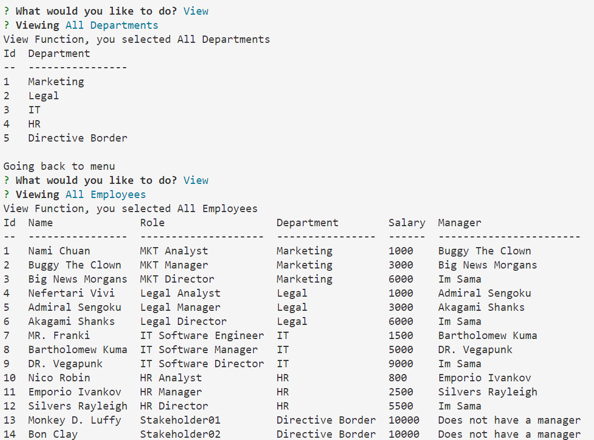

# SQL Database manager
You'll be able to manage an entire company through your command line interface Node.js, Inquirer, and MySQL

# 
# Table of Contents
- [Go to installation section](#-installation)
- [Go to usage guide section](#-usage-guide)
- [Go to contribution guidelines section](#-contribution-guidelines)
- [Go to test instructions section](#-test-instructions)
- [Go to questions section](#-questions)

# Installation
Just clone the repository and run "node ./index.js"
# Usage Guide
The user can use this application to manage his own company through SQL
# Contribution Guidelines
David Torres
# Test Instructions
None
# License
MIT
# Questions
- Here's my GitHub Profile in case you want to reach out!: https://github.com/davidtc8
- Here's my email in case you want to write me: davidtorresc8@gmail.com

# Image

# Video Section
https://user-images.githubusercontent.com/71146674/198143752-2a445f76-696e-47ba-9880-6f8c9485ecfb.mp4

